# meteo-bretagne-ia

mkdir -p data api frontend
touch scripts/download_arome.py
touch scripts/analyse_meteo.py
touch api/main.py

tree

meteo-bretagne-ia/
├── README.md
├── api/
│   └── main.py
├── data/
├── frontend/
└── scripts/
    ├── analyse_meteo.py
    ├── download_arome.py
    └── resume_ollama.py

python3 -m venv venv
source venv/bin/activate
pip install fastapi uvicorn ollama requests pandas numpy

uvicorn api.main:app --reload

http://127.0.0.1:8000

http://127.0.0.1:8000/meteo/rennes

root@UID7E:/mnt/d/Users/steph/Documents/projet_meteo/meteo-bretagne-ia# tree
.
├── README.md
├── api
│   └── main.py
├── data
├── frontend
└── scripts
    ├── analyse_meteo.py
    ├── download_arome.py
    └── resume_ollama.py

4 directories, 5 files
root@UID7E:/mnt/d/Users/steph/Documents/projet_meteo/meteo-bretagne-ia# python3 -m venv venv
source venv/bin/activate
pip install fastapi uvicorn ollama requests pandas numpy
Collecting fastapi
  Downloading fastapi-0.136.3-py3-none-any.whl (117 kB)
     ━━━━━━━━━━━━━━━━━━━━━━━━━━━━━━━━━━━━━━━━ 117.5/117.5 KB 1.4 MB/s eta 0:00:00
Collecting uvicorn
  Downloading uvicorn-0.48.0-py3-none-any.whl (71 kB)
     ━━━━━━━━━━━━━━━━━━━━━━━━━━━━━━━━━━━━━━━━ 71.4/71.4 KB 2.9 MB/s eta 0:00:00
Collecting ollama
  Downloading ollama-0.6.2-py3-none-any.whl (15 kB)
Collecting requests
  Downloading requests-2.34.2-py3-none-any.whl (73 kB)
     ━━━━━━━━━━━━━━━━━━━━━━━━━━━━━━━━━━━━━━━━ 73.1/73.1 KB 2.9 MB/s eta 0:00:00
Collecting pandas
  Downloading pandas-2.3.3-cp310-cp310-manylinux_2_24_x86_64.manylinux_2_28_x86_64.whl (12.8 MB)
     ━━━━━━━━━━━━━━━━━━━━━━━━━━━━━━━━━━━━━━━━ 12.8/12.8 MB 5.3 MB/s eta 0:00:00
Collecting numpy
  Using cached numpy-2.2.6-cp310-cp310-manylinux_2_17_x86_64.manylinux2014_x86_64.whl (16.8 MB)
Collecting typing-inspection>=0.4.2
  Downloading typing_inspection-0.4.2-py3-none-any.whl (14 kB)
Collecting starlette>=0.46.0
  Downloading starlette-1.1.0-py3-none-any.whl (72 kB)
     ━━━━━━━━━━━━━━━━━━━━━━━━━━━━━━━━━━━━━━━━ 72.9/72.9 KB 2.4 MB/s eta 0:00:00
Collecting pydantic>=2.9.0
  Downloading pydantic-2.13.4-py3-none-any.whl (472 kB)
     ━━━━━━━━━━━━━━━━━━━━━━━━━━━━━━━━━━━━━━━━ 472.3/472.3 KB 4.5 MB/s eta 0:00:00
Collecting annotated-doc>=0.0.2
  Using cached annotated_doc-0.0.4-py3-none-any.whl (5.3 kB)
Collecting typing-extensions>=4.8.0
  Using cached typing_extensions-4.15.0-py3-none-any.whl (44 kB)
Collecting h11>=0.8
  Downloading h11-0.16.0-py3-none-any.whl (37 kB)
Collecting click>=7.0
  Downloading click-8.4.1-py3-none-any.whl (116 kB)
     ━━━━━━━━━━━━━━━━━━━━━━━━━━━━━━━━━━━━━━━━ 116.6/116.6 KB 1.9 MB/s eta 0:00:00
Collecting httpx>=0.27
  Using cached httpx-0.28.1-py3-none-any.whl (73 kB)
Collecting charset_normalizer<4,>=2
  Downloading charset_normalizer-3.4.7-cp310-cp310-manylinux2014_x86_64.manylinux_2_17_x86_64.manylinux_2_28_x86_64.whl (216 kB)
     ━━━━━━━━━━━━━━━━━━━━━━━━━━━━━━━━━━━━━━━━ 216.9/216.9 KB 5.7 MB/s eta 0:00:00
Collecting urllib3<3,>=1.26
  Downloading urllib3-2.7.0-py3-none-any.whl (131 kB)
     ━━━━━━━━━━━━━━━━━━━━━━━━━━━━━━━━━━━━━━━━ 131.1/131.1 KB 3.3 MB/s eta 0:00:00
Collecting certifi>=2023.5.7
  Downloading certifi-2026.5.20-py3-none-any.whl (134 kB)
     ━━━━━━━━━━━━━━━━━━━━━━━━━━━━━━━━━━━━━━━━ 134.1/134.1 KB 2.7 MB/s eta 0:00:00
Collecting idna<4,>=2.5
  Downloading idna-3.16-py3-none-any.whl (74 kB)
     ━━━━━━━━━━━━━━━━━━━━━━━━━━━━━━━━━━━━━━━━ 74.2/74.2 KB 6.5 MB/s eta 0:00:00
Collecting pytz>=2020.1
  Downloading pytz-2026.2-py2.py3-none-any.whl (510 kB)
     ━━━━━━━━━━━━━━━━━━━━━━━━━━━━━━━━━━━━━━━━ 510.1/510.1 KB 3.8 MB/s eta 0:00:00
Collecting tzdata>=2022.7
  Downloading tzdata-2026.2-py2.py3-none-any.whl (349 kB)
     ━━━━━━━━━━━━━━━━━━━━━━━━━━━━━━━━━━━━━━━━ 349.3/349.3 KB 5.9 MB/s eta 0:00:00
Collecting python-dateutil>=2.8.2
  Using cached python_dateutil-2.9.0.post0-py2.py3-none-any.whl (229 kB)
Collecting anyio
  Downloading anyio-4.13.0-py3-none-any.whl (114 kB)
     ━━━━━━━━━━━━━━━━━━━━━━━━━━━━━━━━━━━━━━━━ 114.4/114.4 KB 3.7 MB/s eta 0:00:00
Collecting httpcore==1.*
  Downloading httpcore-1.0.9-py3-none-any.whl (78 kB)
     ━━━━━━━━━━━━━━━━━━━━━━━━━━━━━━━━━━━━━━━━ 78.8/78.8 KB 497.7 kB/s eta 0:00:00
Collecting pydantic-core==2.46.4
  Downloading pydantic_core-2.46.4-cp310-cp310-manylinux_2_17_x86_64.manylinux2014_x86_64.whl (2.1 MB)
     ━━━━━━━━━━━━━━━━━━━━━━━━━━━━━━━━━━━━━━━━ 2.1/2.1 MB 4.5 MB/s eta 0:00:00
Collecting annotated-types>=0.6.0
  Using cached annotated_types-0.7.0-py3-none-any.whl (13 kB)
Collecting six>=1.5
  Using cached six-1.17.0-py2.py3-none-any.whl (11 kB)
Collecting exceptiongroup>=1.0.2
  Downloading exceptiongroup-1.3.1-py3-none-any.whl (16 kB)
Installing collected packages: pytz, urllib3, tzdata, typing-extensions, six, numpy, idna, h11, click, charset_normalizer, certifi, annotated-types, annotated-doc, uvicorn, typing-inspection, requests, python-dateutil, pydantic-core, httpcore, exceptiongroup, pydantic, pandas, anyio, starlette, httpx, ollama, fastapi
Successfully installed annotated-doc-0.0.4 annotated-types-0.7.0 anyio-4.13.0 certifi-2026.5.20 charset_normalizer-3.4.7 click-8.4.1 exceptiongroup-1.3.1 fastapi-0.136.3 h11-0.16.0 httpcore-1.0.9 httpx-0.28.1 idna-3.16 numpy-2.2.6 ollama-0.6.2 pandas-2.3.3 pydantic-2.13.4 pydantic-core-2.46.4 python-dateutil-2.9.0.post0 pytz-2026.2 requests-2.34.2 six-1.17.0 starlette-1.1.0 typing-extensions-4.15.0 typing-inspection-0.4.2 tzdata-2026.2 urllib3-2.7.0 uvicorn-0.48.0
(venv) root@UID7E:/mnt/d/Users/steph/Documents/projet_meteo/meteo-bretagne-ia# uvicorn api.main:app --reload
INFO:     Will watch for changes in these directories: ['/mnt/d/Users/steph/Documents/projet_meteo/meteo-bretagne-ia']
ERROR:    [Errno 98] Address already in use
(venv) root@UID7E:/mnt/d/Users/steph/Documents/projet_meteo/meteo-bretagne-ia#

uvicorn api.main:app --reload --port 8001

v0
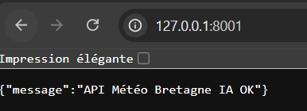
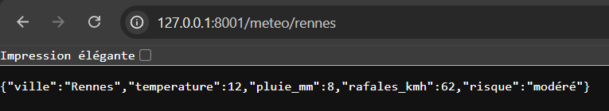
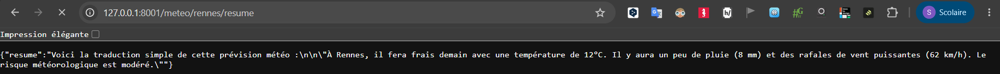

v1
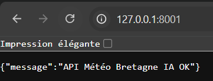
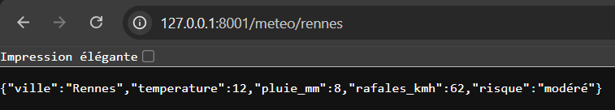
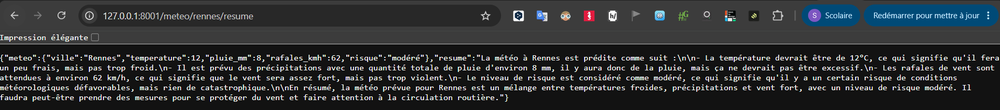
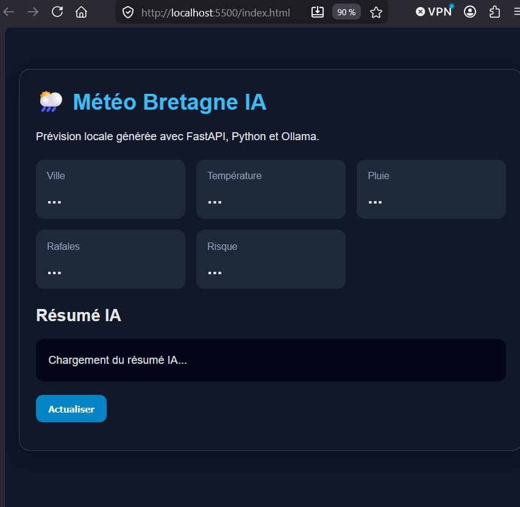
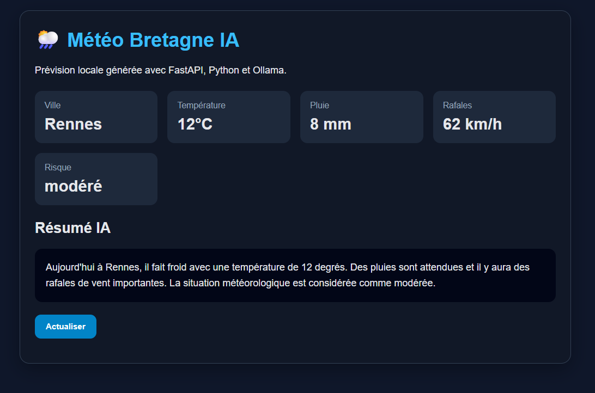

v2
uvicorn api.main:app --reload --port 8001
pip install requests fastapi uvicorn
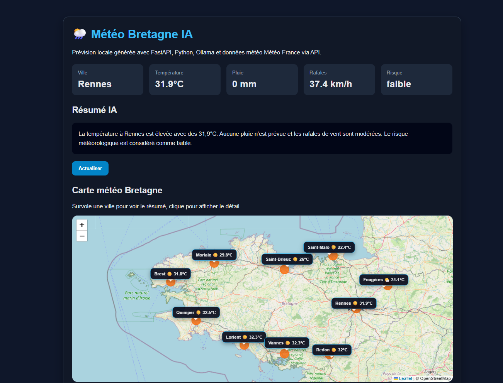
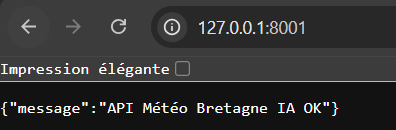
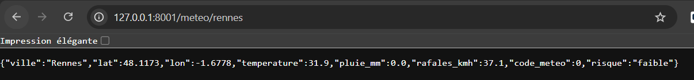
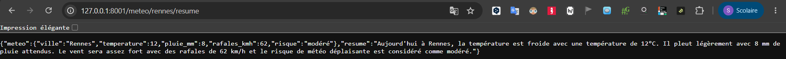
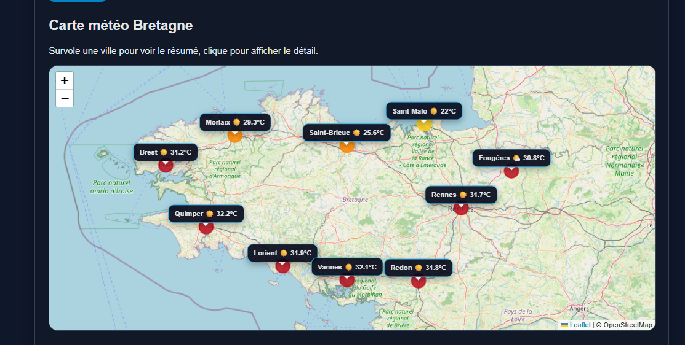

v3
sudo apt update
sudo apt install libeccodes0 -y
pip install xarray cfgrib eccodes pandas numpy fastapi uvicorn requests

pip install sqlalchemy psycopg2-binary apscheduler requests

http://127.0.0.1:8001/
{"message":"API Météo Bretagne IA OK"}

http://127.0.0.1:8001/meteo/rennes
{"ville":"Rennes","lat":48.1173,"lon":-1.6778,"temperature":30.2,"pluie_mm":0.0,"rafales_kmh":28.8,"code_meteo":0,"risque":"faible"}

http://127.0.0.1:8001/meteo/rennes/resume
{"meteo":{"ville":"Rennes","lat":48.1173,"lon":-1.6778,"temperature":30.2,"pluie_mm":0.0,"rafales_kmh":28.8,"code_meteo":0,"risque":"faible"},"resume":"Il fait chaud à Rennes avec une température de 30,2 degrés Celsius. Pas de pluie prévue mais des rafales de vent de 28,8 km/h sont attendues. Le risque de mauvais temps est faible aujourd'hui."}

http://127.0.0.1:8001/meteo/bretagne
{"detail":"Not Found"}

http://127.0.0.1:8001/api/meteo/bretagne
[{"ville":"Rennes","lat":48.1173,"lon":-1.6778,"temperature":30.2,"pluie_mm":0.0,"rafales_kmh":28.8,"code_meteo":0,"risque":"faible"},{"ville":"Brest","lat":48.3904,"lon":-4.4861,"temperature":29.2,"pluie_mm":0.0,"rafales_kmh":36.0,"code_meteo":0,"risque":"faible"},{"ville":"Quimper","lat":47.996,"lon":-4.102,"temperature":29.4,"pluie_mm":0.0,"rafales_kmh":31.3,"code_meteo":0,"risque":"faible"},{"ville":"Lorient","lat":47.7482,"lon":-3.3702,"temperature":30.2,"pluie_mm":0.0,"rafales_kmh":28.8,"code_meteo":0,"risque":"faible"},{"ville":"Vannes","lat":47.6582,"lon":-2.7608,"temperature":30.0,"pluie_mm":0.0,"rafales_kmh":24.1,"code_meteo":0,"risque":"faible"},{"ville":"Saint-Brieuc","lat":48.5142,"lon":-2.7658,"temperature":23.4,"pluie_mm":0.0,"rafales_kmh":14.4,"code_meteo":0,"risque":"faible"},{"ville":"Saint-Malo","lat":48.6493,"lon":-2.0257,"temperature":22.9,"pluie_mm":0.0,"rafales_kmh":20.2,"code_meteo":0,"risque":"faible"},{"ville":"Morlaix","lat":48.5775,"lon":-3.827,"temperature":27.2,"pluie_mm":0.0,"rafales_kmh":29.9,"code_meteo":0,"risque":"faible"},{"ville":"Redon","lat":47.6514,"lon":-2.084,"temperature":29.9,"pluie_mm":0.0,"rafales_kmh":21.2,"code_meteo":0,"risque":"faible"},{"ville":"Fougères","lat":48.3516,"lon":-1.199,"temperature":28.8,"pluie_mm":0.0,"rafales_kmh":19.4,"code_meteo":0,"risque":"faible"}]

uvicorn api.app.main:app --reload --port 8001

source venv/bin/activate
pip freeze > requirements.txt

v4
OLLAMA_HOST=0.0.0.0:11434 ollama serve

root@UID7E:/mnt/d/Users/steph/Documents/projet_meteo/meteo-bretagne-ia# curl http://127.0.0.1:8001/
{"message":"API Météo Bretagne IA v4 OK"}root@UID7E:/mnt/d/Users/steph/Documents/projet_meteo/meteo-bretagne-ia# curl http://127.0.0http://127.0.0.1:8001/meteo/rennes
{"ville":"Rennes","lat":48.1173,"lon":-1.6778,"temperature":32.0,"pluie_mm":0.0,"rafales_kmh":27.0,"code_meteo":0,"risque":"faible","actualise_le":"2026-05-25T12:45"}root@UID7E:/mnt/d/Users/steph/Documents/projet_meteo/meteo-bretagne-ia# curl http://127.0.0.1:8001http://127.0.0.1:8001/meteo/rennes/resume
{"meteo":{"ville":"Rennes","lat":48.1173,"lon":-1.6778,"temperature":32.0,"pluie_mm":0.0,"rafales_kmh":27.0,"code_meteo":0,"risque":"faible","actualise_le":"2026-05-25T12:45"},"resume":"Demain, il fera chaud à Rennes avec une température de 32 degrés. Pas de pluie prévue et des vents légers avec une rafale pouvant atteindre 27 kilomètres par heure. La météo est considérée comme calme."}root@UID7E:/mnt/d/Users/steph/Documents/projet_meteo/meteo-bretagne-ia# curl http://127.0.0.1:8001/meteo/bretagne
[{"ville":"Rennes","lat":48.1173,"lon":-1.6778,"temperature":32.0,"pluie_mm":0.0,"rafales_kmh":27.0,"code_meteo":0,"risque":"faible","actualise_le":"2026-05-25T12:45"},{"ville":"Brest","lat":48.3904,"lon":-4.4861,"temperature":31.3,"pluie_mm":0.0,"rafales_kmh":23.4,"code_meteo":0,"risque":"faible","actualise_le":"2026-05-25T12:45"},{"ville":"Quimper","lat":47.996,"lon":-4.102,"temperature":32.5,"pluie_mm":0.0,"rafales_kmh":28.4,"code_meteo":0,"risque":"faible","actualise_le":"2026-05-25T12:45"},{"ville":"Lorient","lat":47.7482,"lon":-3.3702,"temperature":31.4,"pluie_mm":0.0,"rafales_kmh":22.7,"code_meteo":0,"risque":"faible","actualise_le":"2026-05-25T12:45"},{"ville":"Vannes","lat":47.6582,"lon":-2.7608,"temperature":32.4,"pluie_mm":0.0,"rafales_kmh":28.4,"code_meteo":0,"risque":"faible","actualise_le":"2026-05-25T12:45"},{"ville":"Saint-Brieuc","lat":48.5142,"lon":-2.7658,"temperature":28.9,"pluie_mm":0.0,"rafales_kmh":21.6,"code_meteo":0,"risque":"faible","actualise_le":"2026-05-25T12:45"},{"ville":"Saint-Malo","lat":48.6493,"lon":-2.0257,"temperature":22.9,"pluie_mm":0.0,"rafales_kmh":14.8,"code_meteo":0,"risque":"faible","actualise_le":"2026-05-25T12:45"},{"ville":"Morlaix","lat":48.5775,"lon":-3.827,"temperature":33.0,"pluie_mm":0.0,"rafales_kmh":31.0,"code_meteo":0,"risque":"faible","actualise_le":"2026-05-25T12:45"},{"ville":"Redon","lat":47.6514,"lon":-2.084,"temperature":31.7,"pluie_mm":0.0,"rafales_kmh":27.7,"code_meteo":0,"risque":"faible","actualise_le":"2026-05-25T12:45"},{"ville":"Fougères","lat":48.3516,"lon":-1.199,"temperature":31.6,"pluie_mm":0.0,"rafales_kmh":28.1,"code_meteo":0,"risque":"faible","actualise_le":"2026-05-25T12:45"}]root@UID7E:/mnt/d/Users/steph/Documents/projet_meteo/meteo-bretagne-ia# curl http://127.0.0.1:8001/api/meteo/bretagne
[{"ville":"Rennes","lat":48.1173,"lon":-1.6778,"temperature":32.0,"pluie_mm":0.0,"rafales_kmh":27.0,"code_meteo":0,"risque":"faible","actualise_le":"2026-05-25T12:45"},{"ville":"Brest","lat":48.3904,"lon":-4.4861,"temperature":31.3,"pluie_mm":0.0,"rafales_kmh":23.4,"code_meteo":0,"risque":"faible","actualise_le":"2026-05-25T12:45"},{"ville":"Quimper","lat":47.996,"lon":-4.102,"temperature":32.5,"pluie_mm":0.0,"rafales_kmh":28.4,"code_meteo":0,"risque":"faible","actualise_le":"2026-05-25T12:45"},{"ville":"Lorient","lat":47.7482,"lon":-3.3702,"temperature":31.4,"pluie_mm":0.0,"rafales_kmh":22.7,"code_meteo":0,"risque":"faible","actualise_le":"2026-05-25T12:45"},{"ville":"Vannes","lat":47.6582,"lon":-2.7608,"temperature":32.4,"pluie_mm":0.0,"rafales_kmh":28.4,"code_meteo":0,"risque":"faible","actualise_le":"2026-05-25T12:45"},{"ville":"Saint-Brieuc","lat":48.5142,"lon":-2.7658,"temperature":28.9,"pluie_mm":0.0,"rafales_kmh":21.6,"code_meteo":0,"risque":"faible","actualise_le":"2026-05-25T12:45"},{"ville":"Saint-Malo","lat":48.6493,"lon":-2.0257,"temperature":22.9,"pluie_mm":0.0,"rafales_kmh":14.8,"code_meteo":0,"risque":"faible","actualise_le":"2026-05-25T12:45"},{"ville":"Morlaix","lat":48.5775,"lon":-3.827,"temperature":33.0,"pluie_mm":0.0,"rafales_kmh":31.0,"code_meteo":0,"risque":"faible","actualise_le":"2026-05-25T12:45"},{"ville":"Redon","lat":47.6514,"lon":-2.084,"temperature":31.7,"pluie_mm":0.0,"rafales_kmh":27.7,"code_meteo":0,"risque":"faible","actualise_le":"2026-05-25T12:45"},{"ville":"Fougères","lat":48.3516,"lon":-1.199,"temperature":31.6,"pluie_mm":0.0,"rafales_kmh":28.1,"code_meteo":0,"risque":"faible","actualise_le":"2026-05-25T12:45"}]root@UID7E:/mnt/d/Users/steph/Documents/projet_meteo/meteo-bretagne-ia#

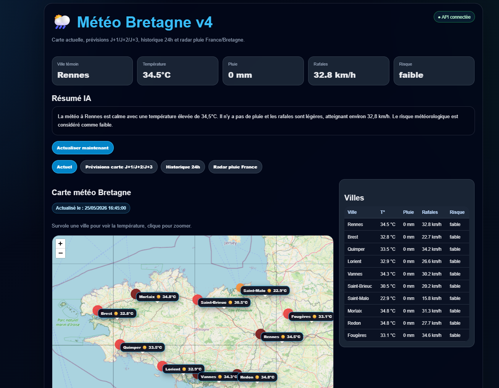
http://localhost:5500/index.html

sudo nano /etc/apache2/sites-available/meteo-bretagne.loto-tracker.fr.conf

Active :
sudo a2enmod proxy proxy_http
sudo a2ensite meteo-bretagne.loto-tracker.fr.conf
sudo systemctl reload apache2

Puis SSL :
sudo certbot --apache -d xn--mto-bretagne-bebb.loto-tracker.fr

Le vrai nom technique du domaine accentué est :
xn--mto-bretagne-bebb.loto-tracker.fr

Pour ton erreur API sur le domaine, il faut surtout corriger le front :

const API_BASE_URL = "";

Puis redéployer le conteneur frontend :

cd ~/meteo/meteo-bretagne
docker compose up --build -d

pkill ollama
OLLAMA_HOST=0.0.0.0:11434 ollama serve

root@UID7E:/mnt/d/Users/steph/Documents/projet_meteo/meteo-bretagne-ia# curl "http://127.0.0.1:8001/api/gfs/download?forecast_hour=3"
{"file":"data/grib/gfs_bretagne_20260525_18_f003.grib2","date":"20260525","cycle":"18","forecast_hour":3,"size_mb":0.0}root@UID7E:/mroot@UID7E:/mnt/d/Users/steph/Documents/projet_meteo/meteo-bretagne-ia# curl "http://127.0.0.1:8001/api/gfs/read?path=data/grib/TON_FICHIER.grib2"
Internal Server Errorroot@UID7E:/mnt/d/Users/steph/Documents/projet_meteo/meteo-bretagne-ia#

curl https://xn--mto-bretagne-bebb.loto-tracker.fr/api/meteo/bretagne
 [{"ville":"Rennes","lat":48.1173,"lon":-1.6778,"temperature":34.3,"pluie_mm":0.0,"rafales_kmh":32.4,"code_meteo":1,"risque":"faible","actualise_le":"2026-05-27T14:45"},{"ville":"Brest","lat":48.3904,"lon":-4.4861,"temperature":25.4,"pluie_mm":0.0,"rafales_kmh":27.0,"code_meteo":0,"risque":"faible","actualise_le":"2026-05-27T14:45"},{"ville":"Quimper","lat":47.996,"lon":-4.102,"temperature":30.4,"pluie_mm":0.0,"rafales_kmh":27.7,"code_meteo":0,"risque":"faible","actualise_le":"2026-05-27T14:45"},{"ville":"Lorient","lat":47.7482,"lon":-3.3702,"temperature":29.4,"pluie_mm":0.0,"rafales_kmh":23.0,"code_meteo":0,"risque":"faible","actualise_le":"2026-05-27T14:45"},{"ville":"Vannes","lat":47.6582,"lon":-2.7608,"temperature":32.4,"pluie_mm":0.0,"rafales_kmh":28.8,"code_meteo":0,"risque":"faible","actualise_le":"2026-05-27T14:45"},{"ville":"Saint-Brieuc","lat":48.5142,"lon":-2.7658,"temperature":32.9,"pluie_mm":0.0,"rafales_kmh":32.0,"code_meteo":0,"risque":"faible","actualise_le":"2026-05-27T14:45"},{"ville":"Saint-Malo","lat":48.6493,"lon":-2.0257,"temperature":31.4,"pluie_mm":0.0,"rafales_kmh":33.5,"code_meteo":1,"risque":"faible","actualise_le":"2026-05-27T14:45"},{"ville":"Morlaix","lat":48.5775,"lon":-3.827,"temperature":33.2,"pluie_mm":0.0,"rafales_kmh":29.5,"code_meteo":1,"risque":"faible","actualise_le":"2026-05-27T14:45"},{"ville":"Redon","lat":47.6514,"lon":-2.084,"temperature":34.7,"pluie_mm":0.0,"rafales_kmh":30.2,"code_meteo":0,"risque":"faible","actualise_le":"2026-05-27T14:45"},{"ville":"Fougères","lat":48.3516,"lon":-1.199,"temperature":33.1,"pluie_mm":0.0,"rafales_kmh":38.2,"code_meteo":0,"risque":"faible","actualise_le":"2026-05-27T14:45"}]

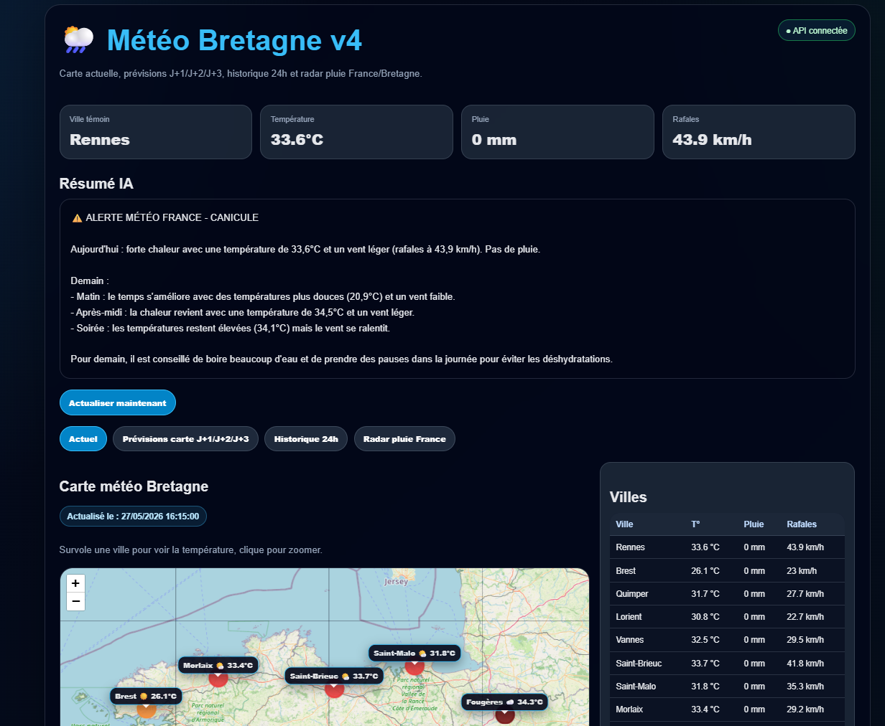

root@UID7E:/mnt/d/Users/steph/Documents/projet_meteo/meteo-bretagne-ia# OLLAMA_HOST=0.0.0.0:11434 ollama serve
Error: listen tcp 0.0.0.0:11434: bind: address already in use
root@UID7E:/mnt/d/Users/steph/Documents/projet_meteo/meteo-bretagne-ia#

root@UID7E:/mnt/d/Users/steph/Documents/projet_meteo/meteo-bretagne-ia# curl "http://127.0.0.1:8001/api/gfs/download?forecast_hour=6"
{"file":"/app/data/grib/gfs_bretagne_20260526_00_f006.grib2","date":"20260526","cycle":"00","forecast_hour":6,"size_mb":0.01,"url":"https://nomads.ncep.noaa.gov/cgi-bin/filter_gfs_0p25.pl?dir=%2Fgfs.20260526%2F00%2Fatmos&file=gfs.t00z.pgrb2.0p25.f006&lev_2_m_above_ground=on&lev_10_m_above_ground=on&lev_surface=on&var_TMP=on&var_GUST=on&var_APCP=on&subregion=&leftlon=-6&rightlon=10&toplat=52&boroot@UID7E:/mnt/d/Users/steph/Documents/projet_meteo/meteo-bretagne-ia# docker exec -it api_meteo_bretagne grib_ls /app/data/grib/gfs_bretagne_20260526_00_f006.grib20_f006.grib2
/app/data/grib/gfs_bretagne_20260526_00_f006.grib2
edition      centre       date         dataType     gridType     stepRange    typeOfLevel  level        shortName    packingType
2            kwbc         20260526     fc           regular_ll   6            surface      0            gust         grid_simple
2            kwbc         20260526     fc           regular_ll   6            surface      0            t            grid_simple
2            kwbc         20260526     fc           regular_ll   6            heightAboveGround  2            2t           grid_simple
2            kwbc         20260526     fc           regular_ll   0-6          surface      0            tp           grid_simple
2            kwbc         20260526     fc           regular_ll   0-6          surface      0            tp           grid_simple
5 of 5 messages in /app/data/grib/gfs_bretagne_20260526_00_f006.grib2

stefdev@ubuntu:~/meteo/meteo-bretagne$ curl -i http://127.0.0.1:8001/meteo/rennes
HTTP/1.1 503 Service Unavailable
date: Wed, 27 May 2026 23:53:10 GMT
server: uvicorn
content-length: 118
content-type: application/json

{"detail":"API météo temporairement limitée : trop de requêtes vers Open-Meteo. Réessaie dans quelques minutes."}
