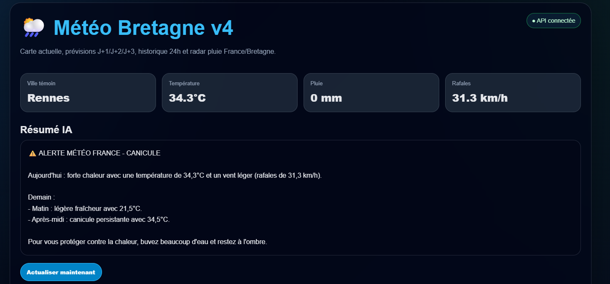

# 🌦️ Météo Bretagne

Application web météo dédiée à la Bretagne développée avec **FastAPI**, **Python**, **Leaflet.js**, **Ollama**, **PostgreSQL** et **Docker**.

Le projet permet d’afficher en temps réel :
- les conditions météo des principales villes bretonnes,
- des cartes interactives,
- des prévisions J+1 / J+2 / J+3,
- un radar pluie animé,
- un historique météo,
- ainsi qu’un résumé météo automatique.

---

# 🚀 Démonstration

## 🌐 Site web
https://xn--mto-bretagne-bebb.loto-tracker.fr

## 🔌 API REST
https://xn--mto-bretagne-bebb.loto-tracker.fr/api/meteo/bretagne

## 💻 GitHub
https://github.com/SDINAHET/meteo-bretagne

---

# ✨ Fonctionnalités

- 🌡️ Température en temps réel
- 🌧️ Pluie et rafales
- 🗺️ Carte météo interactive Leaflet
- 📍 Marqueurs dynamiques par ville
- 📅 Prévisions météo J+1 / J+2 / J+3
- 🌧️ Radar pluie RainViewer animé
- 📊 Historique météo PostgreSQL
- 🔄 Actualisation automatique
- 📱 Interface responsive
- 🔒 HTTPS avec Apache + Let's Encrypt
- 🐳 Déploiement Docker
- ⚡ API REST FastAPI

---

# 🛠️ Stack technique

## Backend
- Python 3
- FastAPI
- Uvicorn
- SQLAlchemy
- PostgreSQL
- Requests
- Pandas
- NumPy

## Frontend
- HTML5
- CSS3
- JavaScript
- Leaflet.js
- FontAwesome

## Infrastructure
- Docker
- Docker Compose
- Apache2 Reverse Proxy
- Certbot / Let's Encrypt
- Ubuntu Server

---

# 📂 Structure du projet

```bash
meteo-bretagne/
├── api/
├── data/
├── frontend/
├── scripts/
├── docker-compose.yml
├── requirements.txt
└── README.md
```

---

# ⚙️ Installation

## 1️⃣ Cloner le projet

```bash
git clone -b serveur2_meteo https://github.com/SDINAHET/meteo-bretagne.git

cd meteo-bretagne
```

---

## 2️⃣ Créer l’environnement virtuel

```bash
python3 -m venv venv

source venv/bin/activate
```

---

## 3️⃣ Installer les dépendances

```bash
pip install -r requirements.txt
```

Ou manuellement :

```bash
pip install fastapi uvicorn requests pandas numpy sqlalchemy psycopg2-binary apscheduler
```

---

# ▶️ Lancer l’API

```bash
uvicorn api.main:app --reload --port 8001
```

API disponible sur :

```text
http://127.0.0.1:8001
```

---

# 📡 Principaux endpoints

## Vérification API

```http
GET /
```

Réponse :

```json
{
  "message": "API Météo Bretagne OK"
}
```

---

## Météo Rennes

```http
GET /meteo/rennes
```

---

## Résumé météo

```http
GET /meteo/rennes/resume
```



---

## Carte météo Bretagne

```http
GET /api/meteo/bretagne
```

---

## Prévisions Bretagne

```http
GET /api/meteo/previsions/bretagne
```

---

## Historique météo

```http
GET /api/meteo/historique/24h
```

---

## Radar pluie

```http
GET /api/rainviewer/weather-maps
```

---

# 🌐 Configuration frontend

## Développement local

```js
const API_BASE_URL = "http://127.0.0.1:8001";
```

## Production avec reverse proxy Apache

```js
const API_BASE_URL = "";
```

---

# 🔁 Reverse Proxy Apache

## Activation des modules

```bash
sudo a2enmod proxy proxy_http ssl headers rewrite
```

---

## Exemple VirtualHost

```apache
<VirtualHost *:443>

    ServerName xn--mto-bretagne-bebb.loto-tracker.fr

    SSLEngine on

    ProxyPreserveHost On

    ProxyPass /api/ http://127.0.0.1:8001/api/
    ProxyPassReverse /api/ http://127.0.0.1:8001/api/

    ProxyPass /meteo/ http://127.0.0.1:8001/meteo/
    ProxyPassReverse /meteo/ http://127.0.0.1:8001/meteo/

</VirtualHost>
```

---

# 🔐 HTTPS

```bash
sudo certbot --apache -d xn--mto-bretagne-bebb.loto-tracker.fr
```

---

# 🐳 Docker

## Build et lancement

```bash
docker compose up --build -d
```

---

# 📊 Fonctionnalités avancées

- Carte météo dynamique Bretagne
- Radar pluie animé
- Historique météo PostgreSQL
- Timeline météo
- Préchargement radar RainViewer
- Actualisation automatique des données
- Interface responsive dark mode

---
# Tests

Le projet contient des tests automatisés avec `pytest` et `TestClient`.

```bash
pip install pytest httpx
pytest -v

python3 -m pytest -v
httpx http://127.0.0.1:8001/api/meteo/bretagne
```


# 📸 Aperçu

Le projet propose :
- une carte météo interactive,
- un tableau météo par ville,
- un radar pluie animé,
- un historique météo,
- des prévisions multi-jours,
- une interface responsive moderne.

---

# 👨‍💻 Auteur

## Stéphane Dinahet

Développeur Web & Backend

- GitHub : https://github.com/SDINAHET
- LinkedIn : https://www.linkedin.com/in/st%C3%A9phane-dinahet-3b363189/

---

# 📜 Licence

Projet personnel de démonstration technique et pédagogique.
